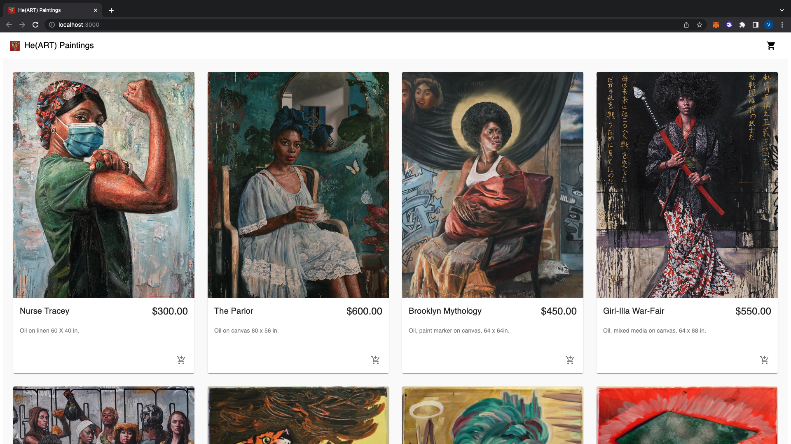

# He(ART) Paintings

<!--- These are examples. See https://shields.io for others or to customize this set of shields. You might want to include dependencies, project status and licence info here --->

<!-- PROJECT LOGO -->
 

  <h3 align="center">He(ART) Paintings</h3>

  

    For every purchase, 25% will go towards teaching coding in New York City public schools.
     

He(ART) Paintings is a fictional E-Commerce site that allows consumers to purchase paintings that are provided.

This project is powered by ReactJS, Commerce.js, and Stripe.

<!-- PROJECT DEMO GIF, AND IMAGES SHOULD BE PUT HERE -->

## Screenshot:

 

<!--- You can link to the deployed site, or a link to the demo recording, or etc. here --->

## Contributing to He(ART) Paintings:

<!--- If your README is long or you have some specific process or steps you want contributors to follow, consider creating a separate CONTRIBUTING.md file--->

To contribute to He(ART) Paintings, follow these steps:

1. Fork this repository.
2. Create a branch: `git checkout -b <branch_name>`.
3. Make your changes and commit them: `git commit -m '<commit_message>'`
4. Push to the original branch: `git push origin <project_name>/<location>`
5. Create the pull request.

Alternatively see the GitHub documentation on [creating a pull request](https://help.github.com/en/github/collaborating-with-issues-and-pull-requests/creating-a-pull-request).

## Contributors/Collaborators:

Thanks to the following people who have contributed to this project:

- [@Adrian Hajdin](https://github.com/adrianhajdin)

## Roadmap:

<!--- This is also a place to share any edge cases you're working on, any current limitations of the project currently and future rollouts  --->

1. Fix the bug that doesn't allow for the cart to refresh/empty itself after payment has been made and confirmation page is rendered.
2. Add more paintings from other artists.
3. Provide filter function to filter which paintings I want to see by artists.
4. Link to partner schools and dynamically render how much money has been raised.
5. Deploy to Netlify or Heroku

## Contact:

<!--- You can add in your linkedin, medium, stack overflow, dev.to account, etc. here --->

If you want to contact me you can reach me at <vjp2109@columbia.edu>.

Connect with me on <a href="https://www.linkedin.com/in/vaughnpole/">LinkedIN</a>

## Additional Resources:

https://reactjs.org/

https://reactrouter.com/en/main

https://commercejs.com/

https://stripe.com/
